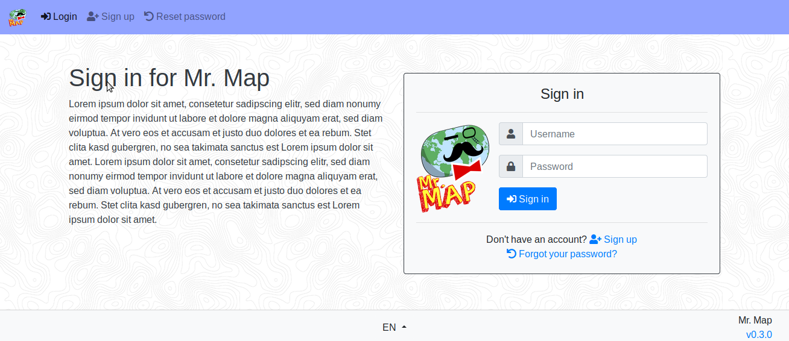

#
Mr. Map is a service registry for web map services ([WMS](https://www.opengeospatial.org/standards/wms)) 
and web feature services ([WFS](https://www.opengeospatial.org/standards/wfs)) as introduced by the 
Open Geospatial Consortium [OGC](http://www.opengeospatial.org/).

Since most GIS solutions out there are specified on a specific use case or aged without proper support, the need
for an open source, generic geospatial registry system is high.

## Functionality
The system provides the following functionalities:

* User management
* Service management
* Metadata Editor 
* Proxy
* Secured Access
* Publisher system
* Dashboard
* Catalogue and API

Please read [FUNCTIONALITY.md](FUNCTIONALITY.mc) for full list of Functions.
  
  
##Links
* [demo]() - user: demo, password: demo
* [quality assurance server]()

##Getting Started
These instructions will get you a copy of the project up and running on your local machine for development and testing purposes. See deployment for notes on how to deploy the project on a live system.

###Install dependencies
* install dependencies on [debian 10](INSTALLDEB10.md)
* <del>install dependencies on [windows 10]()</del> currently we don't have a working manual for windows 

###Initial setup Mr. Map
1. activate your configured virtualenv:
        
        source `PATH-TO-YOUR-VENV`/bin/activate

1. clone the project from the repo to your preferred install directory:
        
        cd `INSTALL-DIR`
        git clone https://git.osgeo.org/gitea/hollsandre/MapSkinner 

    > all following commands are from within the project root directory run.

1. install all requirements:

        pip install -r requirements.txt
        
1. run django migrations:

        python manage.py makemigrations service
        python manage.py makemigrations structure
        python manage.py migrate

1. (Optional) Configure proxy:
    
    Make sure the HTTP_PROXY variable in MapSkinner/settings.py is set correctly for your system

1. run setup routine to get initialized db with admin user for mr. map:
        
        python mangage.py setup
        
###Start up everything we need
> all following commands are from within the project root directory run.
       
1. start up celery process (celery will do async jobs for us)

        celery -A MapSkinner worker -l info
        
1. start up mr. map

        python manage.py runserver_plus
    > [runserver_plus](https://django-extensions.readthedocs.io/en/latest/runserver_plus.html) gives us more debug informations

1. you should see the login page after opening http://127.0.0.1:8000:

    
    
You can now login with the user you configured in your python manage.py setup routine.

##Running the tests
* See [UNITTESTING.md](UNITTESTING.md) for how to run the unit tests.
* See [INTEGRATIONTESTING.md](INTEGRATIONTESTING.md) for how to run the integration tests.

##Deployment
TODO

##Build with
* [django](https://www.djangoproject.com/) - The web framework used
* [bootstrap 4](https://getbootstrap.com/) - Frontend-CSS-Framework
* [fontawesome 5](https://fontawesome.com/) - vector icons and social logos

##Contributing
Please read [CONTRIBUTING.md](CONTRIBUTING.md) for details on our code of conduct, and the process for submitting pull request to us.

##Versioning
We use [SemVer](https://semver.org/) for versioning. For the versions available, see the [tags on this repositry](https://git.osgeo.org/gitea/hollsandre/MapSkinner/releases).  

##Authors
Mr. Map is currently under development by the central spatial infrastructure of Rhineland-Palatinate 
([GDI-RP](https://www.geoportal.rlp.de/mediawiki/index.php/Zentrale_Stelle_GDI-RP)), Germany.

##License
This project is licensed under the MIT License - see the [LICENSE](LICENSE) file for details.